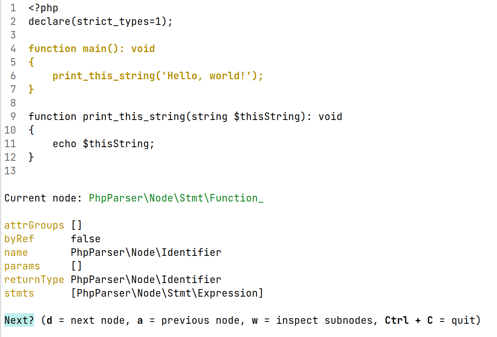

# PHP AST Inspector

This package offers a command-line utility for parsing a PHP script and navigating the resulting Abstract Syntax Tree (AST), showing information about the nodes and highlighting the corresponding part of the original script.



## Installation

```
composer require --dev matthiasnoback/php-ast-inspector
```

## Usage

Run `ast-inspect` by pointing it at a script that you want to inspect, e.g. if your script is called `file.php`:

```
vendor/bin/ast-inspect inspect file.php
```

Now use the keys (`a`, `s`, `d`, `w`, followed by `Enter`) to navigate the node tree. Quit using `Ctrl + C`.
